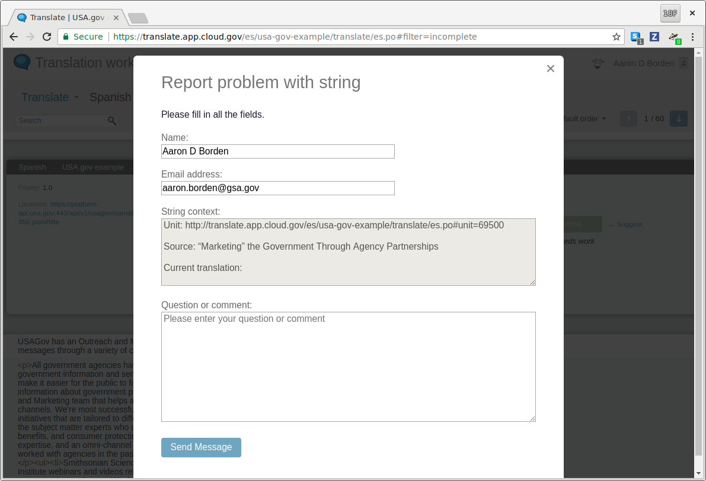

# Pootle

[Pootle][pootle] is an open source localization and translation server. It
facilitates translation workflows using standard localization formats like PO
and XLIFF, enforces quality checks on translations, shares translations across
projects using Translation Memory, and can even use Machine Translation to seed
new translations.

## Workflow

This is Pootle's default workflow. We will look into how this can be customized
and how it deviates from existing government translation workflows in a future
Phase of work.

Conceptual roles:

Role | Description
---  | ---
Content Manager | Manages the project or website. Exports content to be translated and submits it to the Translation Service. Imports updated translations back into the project or website.
Translator | Looks over content to be translated and suggests translations.
Reviewer | Reviews and accepts translations to be used in the project.

### Translation cycle

This is the translation cycle. Translating your project is not a one-time task
since content is constantly changing and evolving.

1. Content Manager identifies new content to be translated.
1. Content Manager exports the content to be translated and submits it to the
   Translation Service.
1. Translators review the content and suggest translations.
1. Reviewers review the translations and accept or reject the translations,
   providing comments when necessary.
1. When new translations are available, the Content Manager imports the
   translations into their project or website.

Translations are reviewed before they are accepted into the project or website.

### Problematic content

Sometimes content can't be translated because it is missing context or it
contains technical markup that is invalid. Translators can flag this for the
Content Managers who can fix the content or add comments and hints for all
translators to see.

### Team roles

From the [permission
docs](http://docs.translatehouse.org/projects/pootle/en/stable-2.8.x/features/permissions.html#action-permissions),
there are different permissions that can be set within a language team.

Role | Description
---  | ---
Member | May submit translation suggestions.
Submitter | Can translate and make suggestions.
Reviewer | In addition to translate and submit suggestions, can also review suggestions.
Administrator | Can administer the team, adding team members and adjusting roles. May edit the announcement of the team. Plus all rights of the Reviewer.

This provides flexibility in how Pootle can be configured based on
existing government translation workflows.

## Import/export of content

Pootle's primary use case is to integrate with a project through a version
control system (VCS) like [git](https://git-scm.com/). Most open source projects
using Pootle are source code based and keep their translations in PO format
side-by-side with their source code within a VCS. This allows developers and
content managers to easily integrate the Pootle translation workflow into their
existing software development life-cycle.

This is different than how content management systems (CMS) work. Many
government projects are built around a CMS, like Drupal, rather than source code
and store translations and content in a database. This doesn't mean Pootle can't
be used with CMS projects but it does mean there is an extra step to getting
translations from Pootle into a CMS. Some CMS, like Drupal, support importing
translations from the PO format.

This workflow is viable for the purposes of our Investigation but more effort
would be needed to automate and improve it for government translation projects.

## Feature evaluation

### What Pootle features are useful today?

### What features are missing that agencies need today?

### Translation Memory

Translation Memory (TM) aids translators in re-using existing translations for
similar phrases. If shared across the federal government, there is a lot of TM
available which reduces the workload on translators.

TM is supported out of the box using an external [Translation Memory
service](http://amagama.translatehouse.org/). You can setup an instance of
Elasticsearch for a private TM server instance.

Pootle supports multiple TM instances at the same time, so it will keep a local
instance up to date, but can still use an external one for read-only lookups
from external projects.

For projects that wish to have their own Pootle instance, they can share TM
across instances by sharing the TM server.

You could also configure topic-specific TM servers. For example, all government
health-related projects could share a TM instance.

### Machine translation

[Machine
translation](http://docs.translatehouse.org/projects/pootle/en/stable-2.8.x/features/machine_translation.html)
is available through [Google Translate](https://cloud.google.com/translate/) (paid
service) and [Yandex](https://tech.yandex.com/translate/) (free + paid). We
configured Yandex to provide machine translations.

### Email

Pootle sends out emails for registrations and notifications. The settings use an
SMTP configuration. We did not configure email for this Investigation.

### File formats

Pootle is powered by the [Translate Toolkit][translate-toolkit] and supports
[many file
formats](http://docs.translatehouse.org/projects/translate-toolkit/en/latest/formats/index.html).
Here is just a sample:

- Gettext (po/pot)
- XLIFF (xliff/xlf)
- TS (ts)
- Mozilla Lang (lang)

Translate Toolkit also provides
[converters](http://docs.translatehouse.org/projects/translate-toolkit/en/latest/commands/index.html#commands-converters)
to convert many different file formats.

### User model

Pootle can set permissions based on individual users.

There is also a [language
team](http://docs.translatehouse.org/projects/pootle/en/stable-2.8.x/features/teams.html)
model so teams can be organized around a single language, across projects.

### User authentication

Pootle uses [django-allauth](https://www.intenct.nl/projects/django-allauth/)
for federated authorization. This provides us with a variety of ways to
authorize users of the Translation Service.

### Offline translation

For translators used to working with the gettext and translate toolkit command
line tools, Pootle provides a download of the translation files for [offline
translations](http://docs.translatehouse.org/projects/pootle/en/stable-2.8.x/features/offline.html).
This also allows translators to do the translation in any external tool they
choose.

### Glossary and terminology

The [Terminology
feature](http://docs.translatehouse.org/projects/pootle/en/stable-2.8.x/features/terminology.html)
allows projects to configure a glossary of terms to help facilitate using
standard set of terms across projects.

This is critical to providing a consistent language experience across an agency
and the federal government.

## Configuration

We configured Pootle using its default settings. Noted are some of the changes.

### Permissions

By default, Pootle allows anonymous users to suggest translations. Projects may
wish to disable this in the [permissions
settings](https://translate.app.cloud.gov/admin/permissions/). We have disabled
anonymous suggestions for Phase I.

## Screenshots

Projects overview page.

Language statistics for an individual project.

Translation UI.

Use government-wide terminology for consistent communication across the
language.

Review suggestions from translators.

Report an issue with a string to the content manager.

[pootle]: http://pootle.translatehouse.org/
[translate-toolkit]: http://toolkit.translatehouse.org/
