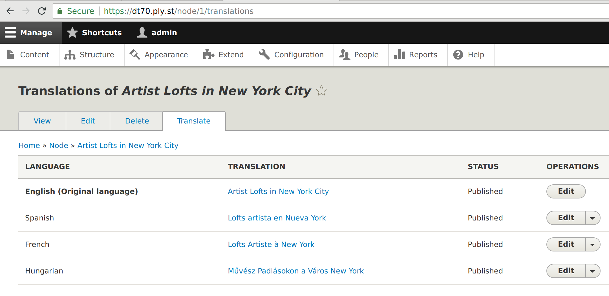
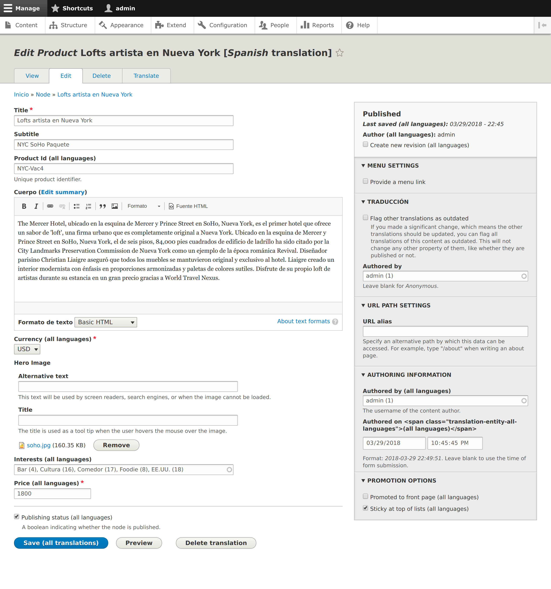

# Drupal

The USA.gov example we're using in Phase I is a [Drupal][drupal] 7 website. They
are not using any of the multilingual modules available to Drupal.

Drupal 8 supports [multilingual content][drupal-multilingual-guide] out of the
box while Drupal 7 requires additional third-party modules.

## How it works

Drupal 8 provides modules to allow translation of content, even within the
website itself.

First, site administrators mark the content to be translated. This can be
entities or their fields.

The Drupal project translates its core components using its own translation
server, [localize.drupal.org][localize-drupal], which is powered by
[l10n_server][l10n_server], a Drupal project. Fundamentally, it's very similar
to how Pootle works. Content is uploaded to the translation server in a standard
format (PO). Translators get to work on the content. Translations are pulled
from the translation server back into your Drupal instance. localize.drupal.org
is not meant to used to translate community content, like the content of your
site, but you can install your own instance to accomplish this.

[l10n_update][l10n_update] exists to pull in the latest core translations from
localize.drupal.org. It can also be configured to pull from your own l10n_server
to update your site content. A similar approach could be done to pull in the
latest translations from Pootle.

[l10n_client][l10n_client] allows translators to translate content directly on
the Drupal site itself. This gives the translator the most context for
translation since they can see the translated content right there on the
website.

[Language commands](https://www.drupal.org/project/drush_language) are available for [Drush](https://www.drush.org), enabling you to create new languages, import PO files, and export to PO format.

You can see an example of a Drupal 8 instance running with multilingual support on
[simplytest.me](https://simplytest.me/project/multilingual_demo/8.x-1.x). Just
click "Launch sandbox" and login with admin/admin username and password.

## Integration with Pootle

The modules provided by Drupal will not work directly with Pootle. However,
under the hood, Drupal is using the same PO/POT file format.

A Content Manager can export translatable content at `/admin/config/regional/translate/export`,
select "Source text only, no translations" and click "Export". This will
download the POT file with all your content to be used with Pootle.

Similarly, you can import your PO files when translations are ready. There is an
opportunity to automate and improve the integration with Pootle or other PO/POT
open source solutions.

## Screenshots

This is the configuration screen showing translations for a single node.

Edit screen for a node in Spanish.

## Resources

- Drupal [Multilingual Guide][drupal-multilingual-guide].
- This article from [Acquia][acquia-multilingual] describes two different
  approaches to translating a Drupal 7 website.

[acquia-multilingual]: https://www.acquia.com/blog/how-make-your-drupal-website-multilingual
[drupal-entity-translation]: https://www.drupal.org/docs/7/modules/entity-translation
[drupal]: https://www.drupal.org/
[drupal-multilingual-guide]: https://www.drupal.org/docs/8/multilingual
[l10n_client]: https://www.drupal.org/project/l10n_client
[l10n_server]: https://www.drupal.org/project/l10n_server
[l10n_update]: https://www.drupal.org/project/l10n_update
[localize-drupal]: https://localize.drupal.org/
